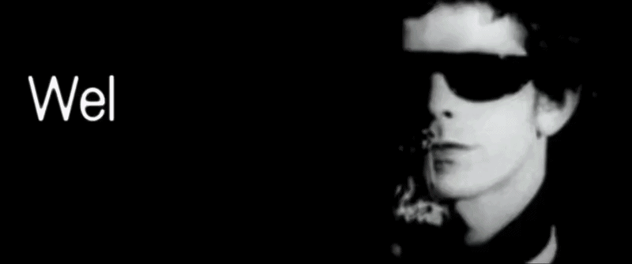

    

## 👤​ À propos de moi

### Salut 👋
Je m'appelle **Louis CASELLA**, j'ai 20 ans et je suis étudiant en première année de BUT Informatique à l'Université de Strasbourg.  
J'aime fouiller sur Internet et bidouiller tout ce qui touche de près ou de loin à l'informatique.  
J'apprécie également le cinéma et la musique, ou mieux encore, les deux à la fois !  

    

## 💻 Langages et outils maîtrisés

### Langages

### Outils

